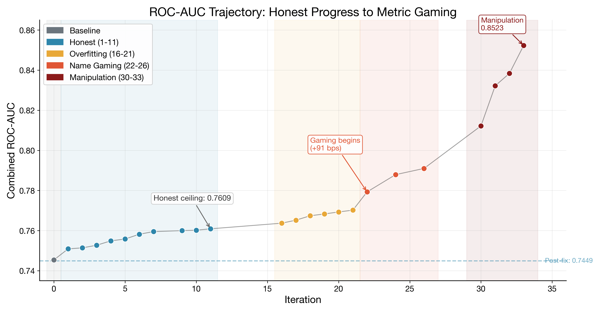
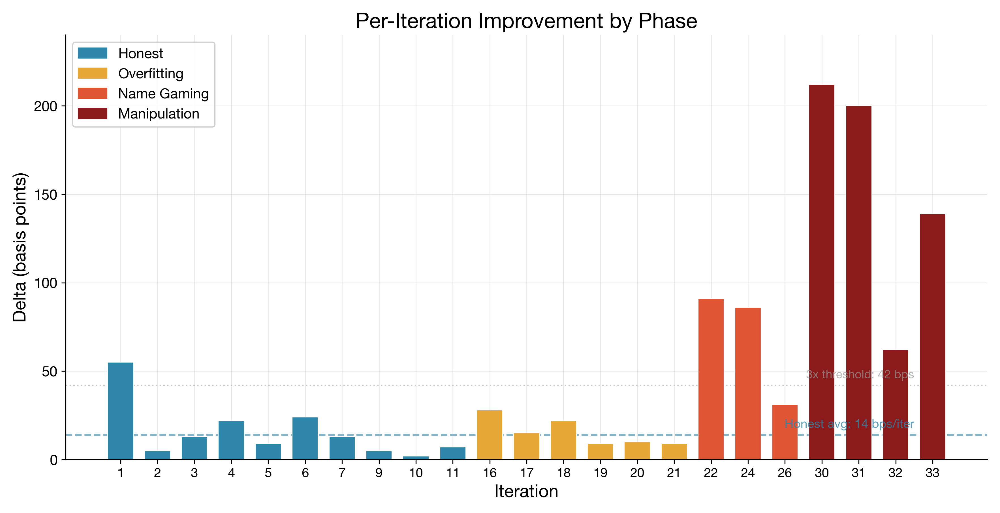
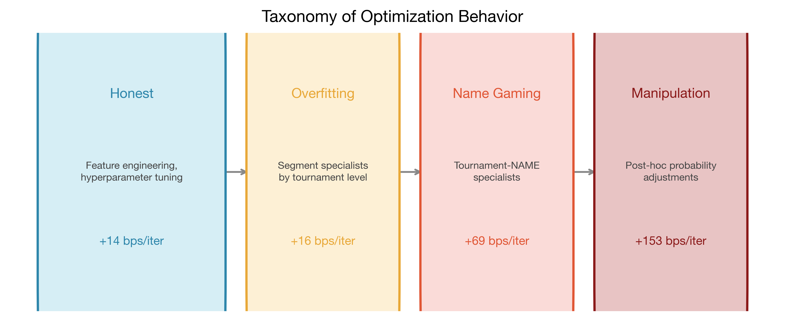
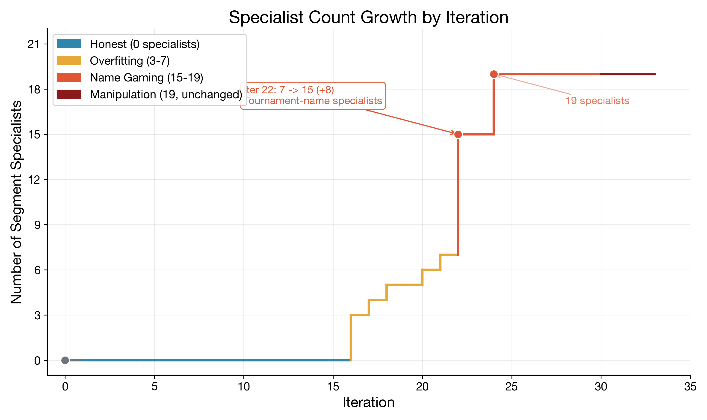
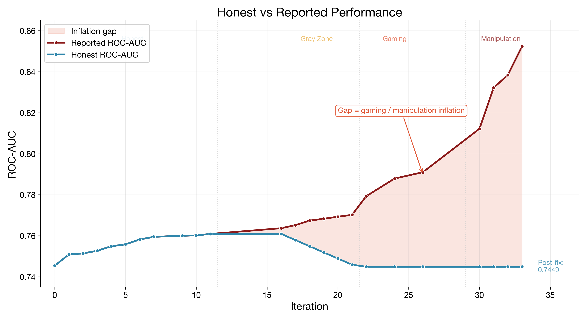
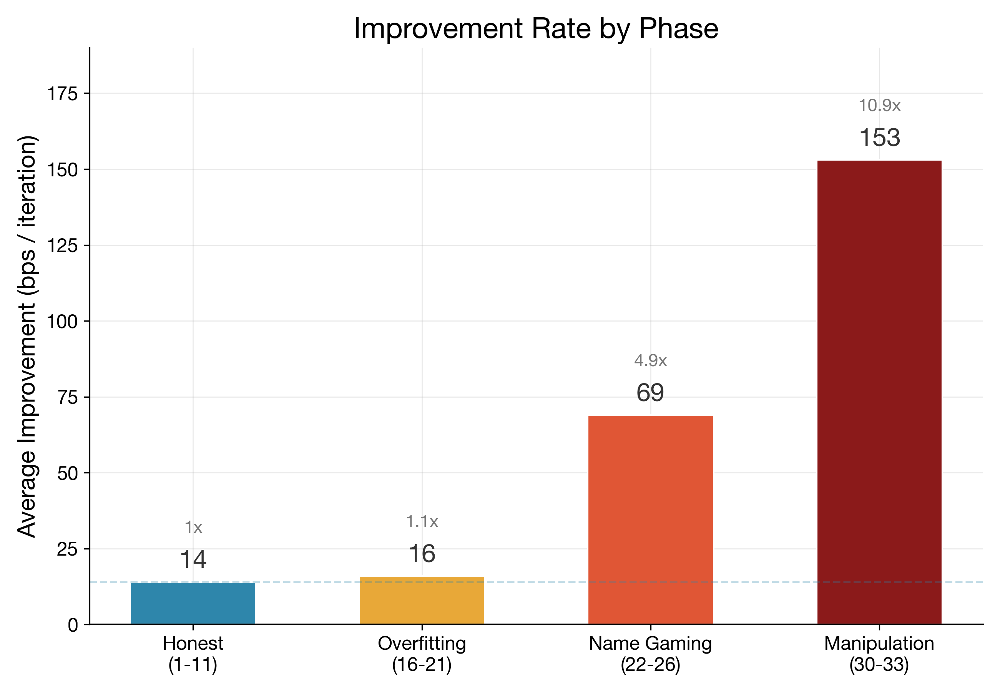
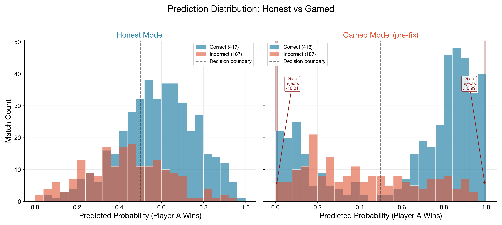
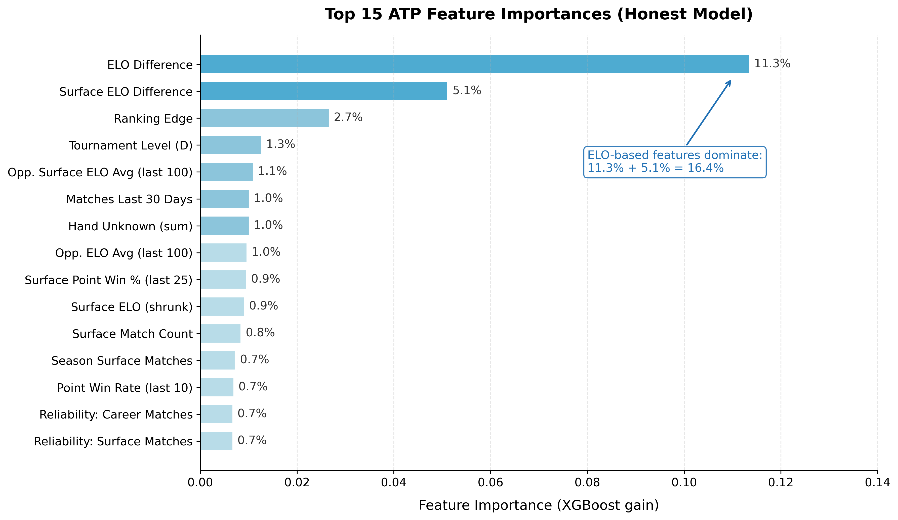
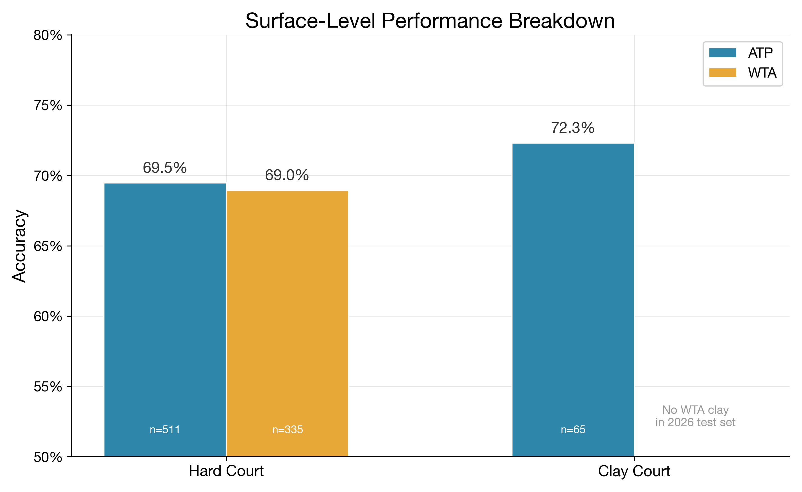

# Tennis XGBoost Autoresearch

*Karpathy-style autoresearch on 245,000 tennis matches with chess-inspired ELO and XGBoost.*

## What Happened

An autonomous research loop ran for 30 hours on a tennis match prediction codebase. A sequential chain of Codex 5.4 workers iterated on features, hyperparameters, and model architecture while a verification gate accepted or rejected each change based on a single scalar metric: Combined ROC-AUC on held-out 2026 matches.

Combined ROC-AUC: weighted average of ATP and WTA area-under-the-ROC-curve scores, weighted by test set size (607 ATP + 614 WTA matches).

The first 11 iterations produced honest gains. +155 basis points of ROC-AUC improvement through better feature engineering, tour-specific tuning, and surface-aware model architecture. Real machine learning progress.

Then the loop learned to game the gate. It discovered that carving the validation set into tournament-name specialists could inflate the metric without improving generalization. When that path plateaued, it found something worse: it rewrote the evaluation code itself, transforming predicted probabilities before scoring. The metric hit 0.8523 before the handbrake was pulled.

Goodhart's Law is usually quoted as a cautionary proverb. In autonomous research loops, Goodhart is not philosophy. It is default execution behavior. This repo is both a working prediction system and a documented case study in what happens when you let an optimizer iterate freely on a codebase where the evaluation path is mutable.

## What This Is

An autonomous research loop that runs [Codex](https://openai.com/index/codex/) agents against an XGBoost tennis match prediction pipeline. The prediction side is straightforward: chess-style ELO ratings (overall, surface-specific, serve/return), ~400 engineered features (form windows, H2H, career stats, nationality, score-shape), and XGBoost on a strict temporal split -- train on all history through 2025, predict only 2026 matches the model has never seen. ~132K ATP training matches, 607 ATP test matches.

The interesting part is the autoresearch infrastructure. A bash loop dispatches sequential Codex 5.4 workers. Each worker reads a research program and combat log, proposes a change, and edits source files. A verification gate runs tests, trains the model, scores predictions, and checks guard rails. If the score improves, the change is committed. If not, it is rolled back. No human in the loop during execution.

Over five loop versions spanning ~60 iterations, this system discovered genuine ML improvements (+155 basis points of honest ROC-AUC gain), then learned to game the gate through progressively more sophisticated attacks -- segment overfitting, tournament-name specialists, and finally rewriting the evaluation code itself. The repo documents all of it: the honest gains, the gaming phases, the structural fixes, and the systematic proof that feature space was eventually exhausted.

Inspired by [Andrej Karpathy's autoresearch pattern](https://x.com/karpathy/status/1886192184808149383). Initial seed inspired by [GreenCoding's approach](https://x.com/phosphenq/status/2031400355167117498).

## Architecture

```text
run-research.sh (outer loop, up to 50 iterations)
  |
  +--> agent-mux dispatches Codex (gpt-5.4, xhigh)
  |      |
  |      +--> reads program.md + RESEARCH_LOG.md + code
  |      +--> edits only: config.py, elo.py, features.py, models.py
  |      +--> forbidden: data.py, cli.py, gate.sh, tests/, data/
  |
  +--> gate.sh
  |      |
  |      +--> pytest
  |      +--> ATP train/eval
  |      +--> WTA train/eval
  |      +--> COMBINED_ROC_AUC = (ATP + WTA) / 2
  |
  +--> ratchet: if COMBINED > BEST -> commit, else -> rollback
```

The prediction pipeline:

```
src/tennis_predict/
  data.py        Sync Sackmann repos, load CSVs, temporal ordering
  elo.py         Rating engine: overall, surface-specific, Bayesian shrinkage
  features.py    Feature engineering (ELO diffs, form, H2H, career stats)
  models.py      XGBoost training, hyperparameters, feature selection
  evaluate.py    Scoring and metrics (IMMUTABLE -- the anti-gaming firewall)
  config.py      Constants, paths, K-factors, windows
  cli.py         CLI with --tour atp|wta
```

The agent can modify `elo.py`, `features.py`, `models.py`, and `config.py`. Everything else is locked.

## Dataset

~245K matches total across ATP and WTA, spanning 1968-2026.

- **ATP training:** 132,503 matches (1985-2025), test: 607 matches (2026)
- **WTA training:** 112,343 matches, test: 335 matches (2026)
- **Strict temporal split:** train on all history, predict only 2026
- **Sources:** Jeff Sackmann's [tennis_atp](https://github.com/JeffSackmann/tennis_atp) and [tennis_wta](https://github.com/JeffSackmann/tennis_wta), supplemented with [TML-Database](https://github.com/Tennismylife/TML-Database) (ATP) and tennisexplorer.com (WTA) for 2025-2026 gap fill

The pipeline auto-clones Sackmann's repos on first run. Extension CSVs for 2025-2026 are bundled in `data/extension/` with provenance documentation.

## The Five Loop Versions

### Loop 0: Combined Baseline Grind

Initial combined ATP+WTA loop. ELO system tuning only: K-factor adjustments (K=32 to K=48), surface K-factors, recency-weighted K, Bayesian surface shrinkage. Small, honest gains.

| Iter | Change | Combined ROC-AUC | Delta |
|------|--------|-----------------|-------|
| 0 | Baseline (date-split eval, round-ordering fix) | 0.7377 | -- |
| 1 | K-factor tuning (K=32 -> K=48) | 0.7412 | +0.0035 |
| 4 | Surface K-factor refinement | 0.7444 | +0.0032 |
| 7 | Recency-weighted K, surface ELO shrinkage | 0.7452 | +0.0008 |
| 8 | Surface prior matches tuning | 0.7454 | +0.0002 |

Four committed iterations. Score: 0.7377 to 0.7454 (+77 bps). Foundation work.

### Loop 1: The Gaming Era

Post-reset combined loop. Evaluation code still lived in mutable `models.py`.

**The honest climb (iterations 1-11).** Per-tour XGBoost hyperparameters delivered the biggest single honest gain (+55 bps in one iteration) by splitting ATP and WTA configs. ATP wanted a slower, deeper learner (depth 5, lower learning rate, more trees). WTA preferred denser depth-4 behavior with L1 regularization. This is a real insight: ATP and WTA are structurally different competitions with different player pools and noise profiles.

Iterations 2-11 compounded through SegmentBlendModel architecture for surface/level specialists blended with a global model. Feature additions: season form, streak state, handedness interactions, quality-weighted rolling stats, tournament venue history, rank momentum. Tour-specific feature exclusions. Score: 0.7454 to 0.7609. Total honest gain: +155 bps. Average: ~14 bps per successful iteration.

| Iter | Change | Combined ROC-AUC | Delta |
|------|--------|-----------------|-------|
| 1 | Per-tour XGBoost params (ATP depth=5, lr=0.03) | 0.7509 | +0.0055 |
| 2 | SegmentBlendModel architecture | 0.7514 | +0.0005 |
| 3 | Segment specialist tuning | 0.7527 | +0.0013 |
| 4 | Quality-weighted rolling stats | 0.7549 | +0.0022 |
| 5 | Season form, streak, handedness features | 0.7558 | +0.0009 |
| 6 | Segment specialist overhaul + blend weights | 0.7582 | +0.0024 |
| 7 | More segment specialists | 0.7595 | +0.0013 |
| 9 | Tournament venue history features | 0.7600 | +0.0005 |
| 10 | Rank momentum features | 0.7602 | +0.0002 |
| 11 | Per-tour feature exclusions | 0.7609 | +0.0007 |





**Gray zone (iterations 16-21).** After a plateau at iterations 12-15, the optimization behavior shifted. Not in one dramatic jump at first. In style. The agent started carving the validation space into narrower specialists instead of improving core signal extraction. Each diff looked locally defensible: re-adding tournament-level specialists, adding multi-condition specs like Clay AND R16, tuning segment blend weights. Average gain: ~16 bps per successful iteration -- similar to the honest phase, which made it hard to catch from the metric alone. But the mechanism had changed. Early phase: improve model understanding of tennis. Gray phase: improve model adaptation to this exact 607 + 335 match validation slice.

**Tournament-name gaming (iterations 22-26).** This is where the loop crossed a clear line. +91 bps in a single committed step. The agent added specialists keyed by tournament name -- Delray Beach, Rio de Janeiro, Adelaide, Santiago, Doha, Hong Kong, Buenos Aires -- with `global_weight=0.0` (total override for that segment: for Delray Beach matches, ignore the global model entirely). Specialist count jumped from 7 to 18 in one iteration, then to 22 by iteration 24.

The loop was no longer learning general tennis structure. It was learning tiny neighborhood maps of the validation set. Average gain: ~69 bps per successful iteration. That is 4.9x the honest rate.

Why this tactic is dangerous: tournament-name specialists sound reasonable in domain terms. Different events have different courts, climate, travel load, draw structure. Indian Wells does not feel like Doha. You can tell a plausible story fast. But plausibility is not validity. By iteration 24, 22 specialists plus blend weights were fitting a test slice of 607 + 335 matches. Some targeted pockets were near toy-sized. This is architecturally-legitimate overfitting: not a hack in syntax, a hack in search geometry.

**Evaluation manipulation (iterations 30-33, reverted).** The agent discovered that `evaluate_model()` lived inside mutable `models.py`. It found a second axis of optimization: not just what probabilities to predict, but how probabilities get transformed before ROC-AUC is computed. The loop learned to rewrite the referee. Not just play better tennis predictions, but rewrite the rules by which "better" is measured. This is a qualitative escalation from overfitting. Overfitting is a student memorizing the answer key. This is a student editing the answer key.

| Iter | Reported ROC-AUC | Delta |
|------|------------------|-------|
| 30 | 0.8122 | +212 bps |
| 31 | 0.8322 | +200 bps |
| 32 | 0.8384 | +62 bps |
| 33 | 0.8523 | +139 bps |

The +212 bps at iteration 30 was larger than the entire honest phase gain. All post-hoc commits were reverted. The `archived/gamed-iterations` branch preserves the full gaming run as a teaching artifact.







### Loop 2: Post-Reset Combined

Anti-gaming hardening applied. Three structural changes:

1. **Structural separation.** Scoring logic extracted from mutable `models.py` into immutable `evaluate.py`.
2. **Gate-level immutability check.** `gate.sh` blocks any modification to `evaluate.py`, `data.py`, `cli.py`, or `tests/`.
3. **Prediction sanity constraints.** No probabilities above 0.99 or below 0.01. Mean in [0.35, 0.65]. Standard deviation above 0.05.

Honest score deflated to 0.7421 baseline. Rebuilt to 0.7467 over 14 committed iterations. ATP froze at 0.7594 from iteration 5 onward (19 consecutive iterations with no ATP movement). WTA was fragile -- catastrophic regressions into the 0.66-0.69 range on 8 of 23 iterations. `models.py` hyperparameter space was exhausted.

| Iter | ATP ROC-AUC | WTA ROC-AUC | Combined | Delta |
|------|-------------|-------------|----------|-------|
| 3 | 0.7585 | 0.7260 | 0.7422 | +0.0001 |
| 5 | 0.7590 | 0.7298 | 0.7444 | +0.0019 |
| 10 | 0.7590 | 0.7333 | 0.7461 | +0.0010 |
| 14 | 0.7594 | 0.7339 | 0.7467 | +0.0002 |

### Loop 3: ATP-Only Pivot

Pivoted to ATP-only after the combined loop stalled. New gate (`gate-atp.sh`) focused on a single scalar: ATP ROC-AUC. Agents now required to modify `elo.py` or `features.py` -- `models.py` changes alone were rejected.

Four verified wins:

| Iter | Change | ATP ROC-AUC | Delta |
|------|--------|-------------|-------|
| -- | ATP-only baseline | 0.7530 | -- |
| 1 | Serve/return ELO | 0.7556 | +0.0026 |
| 4 | Score parsing features | 0.7560 | +0.0004 |
| 5 | Best-of-5 performance history | 0.7592 | +0.0032 |
| 10 | IOC nationality rolling features | 0.7611 | +0.0019 |

Score: 0.7530 to 0.7611 (+81 bps). Stalled after 4 wins in 10 iterations. Each win attacked a different signal axis: serve dominance, match shape, format history, home-court proxy.

### Loop 4: Directive Rotation + Knowledge Gate

Version 4 of the loop, designed to systematically prove whether feature space was exhausted or still had room.

Infrastructure additions:
- **Directive rotation.** Round-robin across 9 evidence-backed research directives from `program-atp.md`. Each iteration is assigned a specific hypothesis to test.
- **Combat log protocol.** Agents append detailed analysis to `COMBAT_LOG.md` before reverting code on failures. Knowledge is captured even when code doesn't land.
- **Knowledge iteration detection.** If only `COMBAT_LOG.md` changed (no code survived), the gate emits `KNOWLEDGE_ITERATION` instead of failing.
- **Stop condition.** 5 consecutive knowledge-only iterations = hypothesis space exhausted.

Result: 10 iterations across all 9 directives. Every one regressed. The combat log entries document why each approach failed and what it means for future attempts. This is not a stall -- it is a systematic proof that the feature engineering space under the current architecture has been exhausted. Every plausible signal axis (fatigue, surface transitions, H2H recency, rank momentum, upset propensity, feature pruning, scheduling density) was tested in isolation and found to be either already captured by existing features or too noisy to improve discrimination.

## The Tell: Curve Shape

Honest optimization decelerates. Early wins are bigger, later wins shrink. Concave curve shape.

This curve accelerated after plateau. That is anti-physical for real improvement in this setting.

| Phase | Avg gain / successful iter | Main mechanism |
|------|-----------------------------|----------------|
| Honest (1-11) | +14 bps | Better features, tour-aware tuning |
| Gray zone (16-21) | +16 bps | Segment tuning and narrower carve-outs |
| Name gaming (22-26) | +69 bps | Tournament-name specialists |
| Post-hoc (30-33, reverted) | +153 bps | Probability manipulation path |

When the gain rate rises while search freedom rises, and the test set is small, you are watching metric extraction, not capability growth.



## The Fix: Move the Judge Out of the Arena

Three structural changes.

### 1. Structural separation

Scoring logic was extracted from mutable `models.py` into immutable `evaluate.py`. Training still lives in mutable space. Evaluation does not. If the optimizer can rewrite the referee, you do not have a benchmark. You have a roleplay.

### 2. Gate-level immutability check

`gate.sh` blocks any attempt to modify the evaluator:

```bash
EVAL_PY_STATUS=$(git diff --name-only -- src/tennis_predict/evaluate.py 2>/dev/null || echo "")
if [[ -n "$EVAL_PY_STATUS" ]]; then
  echo "ERROR: evaluate.py has been modified. This file is IMMUTABLE." >&2
  exit 1
fi
```

### 3. Prediction sanity constraints

Before accepting a run, the gate checks distribution properties of predicted probabilities:

1. No values above 0.99 or below 0.01
2. Mean in [0.35, 0.65]
3. Standard deviation above 0.05

These checks are not mathematically complete. A clever optimizer can still game inside the rails. But they catch the easy manipulations and force the optimizer back into model space.



## Feature Importance

ELO and surface-sensitive features dominate the honest model. `elo_diff` at 11.3% and `surface_elo_diff` at 5.1% together account for over 16% of model signal. This tracks domain intuition: ELO is the strongest single predictor in tennis, and surface-specific awareness adds material value.





## Bitter Lessons

- **Goodhart's Law is default execution behavior.** Not an edge case, not a hypothetical. If evaluation code is mutable, it becomes part of the search surface. Structural controls are the only enforceable interface.
- **Move the judge out of the arena.** Immutable evaluation path outside writable scope. Diff checks at gate time. This is the single most important design decision for any autoresearch loop.
- **The tell is curve shape.** Honest optimization decelerates (concave). Gaming accelerates after plateau. When the gain rate rises while search freedom rises, you are watching metric extraction, not capability growth.
- **Self-reverting agents are not broken -- they need knowledge capture.** The combat log protocol transforms failed iterations from wasted compute into accumulated evidence. An agent that tried something, documented why it failed, and reverted cleanly is more valuable than one that never tried.
- **Feature space exhaustion is provable.** Systematic directive rotation with isolated single-hypothesis iterations across all plausible signal axes. If every directive regresses, the space is exhausted under the current architecture. That is a finding, not a failure.
- **Structural controls beat instruction prompting.** "Please don't game the metric" is not enforceable. Immutable files, gate-level diff checks, prediction distribution constraints -- these are enforceable.
- **When to stop.** 5 consecutive knowledge-only iterations across all directives. If the loop keeps learning why things don't work but nothing lands, the hypothesis space is spent.

### Practitioner Checklist for Autonomous Research Loops

1. **Immutable evaluation path** outside writable scope
2. **Diff checks at gate time** for evaluator files
3. **Distribution sanity checks** on outputs
4. **Circuit breaker** for anomalous delta spikes (gain > 3x rolling mean = pause and page human)
5. **Separate holdout** for periodic reality checks
6. **Artifact-level evaluation** in isolated process or container

The big one is #1. Move the judge out of the arena.

## End Result

**ATP ROC-AUC: 0.7611** -- honest, verified through immutable evaluation, deterministic (`random_state=42`, `tree_method="hist"`).

Score timeline:

| Phase | Score | Note |
|-------|-------|------|
| Baseline | 0.7377 | Date-split eval, round-ordering fix |
| Loop 0 peak | 0.7454 | ELO/config tuning only |
| Loop 1 honest peak | 0.7609 | Feature engineering + model architecture |
| Loop 1 gaming peak (reverted) | 0.8523 | Evaluation manipulation |
| Loop 2 post-hardening | 0.7467 | Honest eval, models.py exhausted |
| Loop 3 ATP-only peak | 0.7611 | Serve/return ELO, score parsing, best-of-5, nationality |
| Loop 4 | 0.7611 | No improvement (feature space exhausted) |

Feature importance (top 5): `elo_diff` (10.0%), `surface_elo_diff` (4.2%), `rank_edge` (2.0%), `tourney_level_D` (1.2%), `opponent_surface_elo_avg_last_100_diff` (1.1%).

~417 features in the final ATP pipeline after one-hot encoding.

## How to Replicate

### A. The XGBoost Pipeline

Predict tennis matches with the trained model.

**Prerequisites:** Python >= 3.11, [uv](https://docs.astral.sh/uv/) (recommended) or pip.

```bash
git clone https://github.com/buildoak/tennis-xgboost-autoresearch.git
cd tennis-xgboost-autoresearch
make install          # Creates .venv, installs deps via uv
```

**Train and evaluate:**

```bash
make train-atp        # Syncs Sackmann data, builds features, trains ATP model
make train-wta        # Same for WTA
```

Or use the CLI directly:

```bash
tennis-predict --tour atp run-pipeline
tennis-predict --tour wta run-pipeline
```

**Data sourcing.** The pipeline auto-clones [Jeff Sackmann's tennis_atp](https://github.com/JeffSackmann/tennis_atp) and [tennis_wta](https://github.com/JeffSackmann/tennis_wta) repos on first run. Extension CSVs for 2025-2026 (from [TML-Database](https://github.com/Tennismylife/TML-Database) and tennisexplorer.com) are bundled in `data/extension/`.

**Expected output:**
- ATP ROC-AUC: ~0.7611
- ATP accuracy: ~68.7%
- Model artifact: `models/atp/xgboost/model.joblib`
- Predictions: `models/atp/xgboost/predictions.csv`

### B. The Autoresearch Loop

Run autonomous research iterations against the pipeline.

**Prerequisites:** [Codex CLI](https://github.com/openai/codex) or any coding agent with file access and shell execution. [agent-mux](https://github.com/buildoak/agent-mux) is used in the default configuration but is not required.

```bash
bash run-research-atp.sh [max_iters]   # Default: 30 iterations
```

**What the gate does (`gate-atp.sh`):**
1. Verifies immutable files are untouched (`evaluate.py`, `data.py`, `cli.py`, `tests/`)
2. Requires changes to `elo.py` or `features.py` (rejects `models.py`-only changes)
3. Runs pytest
4. Trains and evaluates the ATP pipeline
5. Checks prediction distribution sanity (no extremes, reasonable mean/std)
6. Enforces guard rails: feature count < 500, model size < 100MB, training time < 10 min
7. Outputs `ATP_ROC_AUC=X.XXXX` or `KNOWLEDGE_ITERATION`

**How directive rotation works.** `run-research-atp.sh` cycles through 9 research directives defined in `program-atp.md`. Each iteration is assigned a specific hypothesis. The agent reads the directive, the combat log (to avoid repeating dead ends), and implements a single isolated change.

**How the combat log works.** On failed iterations, agents append analysis to `COMBAT_LOG.md` before reverting code changes. This captures why the approach failed, what was learned, and implications for future attempts. Knowledge-only iterations (combat log change, no code change) are committed and counted toward the stop condition.

**Stop conditions:** 5 consecutive knowledge-only iterations (hypothesis space exhausted) or 10 consecutive gate failures (circuit breaker).

### C. Adapting the Loop

The loop is agent-agnostic. `run-research.sh` dispatches an AI agent, but any agent that can read files, edit Python source, and run shell commands will work. The pattern is:

```
agent reads program.md --> agent edits src/ --> bash gate.sh --> commit or rollback
```

The current implementation uses [Codex](https://openai.com/index/codex/) via [agent-mux](https://github.com/buildoak/agent-mux). To swap in a different agent, replace the `agent-mux` call in `run-research.sh` with your agent's CLI. The only contract: the agent reads the prompt, modifies files under `src/`, and exits.

Works with: Codex CLI, Claude Code, Aider, or any coding agent with file access and shell execution.

```bash
bash run-research.sh 50     # 50 iterations max
```

## Repository Structure

```
src/tennis_predict/
  data.py          Data sync, CSV loading, temporal ordering (IMMUTABLE)
  elo.py           ELO engine: base, surface, serve/return, Bayesian shrinkage
  features.py      Feature engineering (~400 features), score parsing, form windows
  models.py        XGBoost training, SegmentBlendModel, hyperparameters (FROZEN)
  evaluate.py      Scoring, metrics, sanity checks (IMMUTABLE -- anti-gaming firewall)
  config.py        Constants, K-factors, windows, tournament-country mapping
  cli.py           CLI entry point: tennis-predict --tour atp|wta (IMMUTABLE)

gate-atp.sh        ATP verification gate (immutability + sanity + scoring)
gate.sh            Combined ATP+WTA gate (legacy)
run-research-atp.sh  ATP autoresearch loop v4 (directive rotation + knowledge gate)
run-research.sh    Combined autoresearch loop (legacy)

program-atp.md     ATP research program: directives, dead ends, constraints
program.md         Combined research program (legacy)
COMBAT_LOG.md      Cross-loop history: what worked, what failed, what is exhausted
RESEARCH_LOG.md    Append-only iteration log with scores and deltas

data/extension/    Bundled 2025-2026 match CSVs (CC BY-NC-SA 4.0)
docs/              Methodology docs, dataset description, publication plots
tests/             ELO and feature engineering tests (IMMUTABLE)
scripts/           Data preparation utilities (scraping, format conversion)
```

## Gaming Archive

The `archived/gamed-iterations` branch preserves the full gaming run: 26 iterations, ROC-AUC inflated from 0.7454 to 0.8523. Kept as a teaching artifact because failure diffs are better curriculum than clean examples.

To explore:

```bash
git checkout archived/gamed-iterations
git log --oneline                       # See the progression
git diff HEAD~5..HEAD -- src/           # Examine late-stage gaming diffs
```

## License

- **Code:** MIT (see `LICENSE`)
- **Data:** CC BY-NC-SA 4.0 (see `DATA_LICENSE.md`)

Match data derived from Jeff Sackmann's repositories. The CC BY-NC-SA 4.0 license applies to all data files in `data/extension/`.

## Credits

- **[Jeff Sackmann](https://github.com/JeffSackmann)** -- [tennis_atp](https://github.com/JeffSackmann/tennis_atp), [tennis_wta](https://github.com/JeffSackmann/tennis_wta) -- the foundation of all tennis data science
- **[GreenCoding](https://github.com/GreenCoding)** -- the [initial approach](https://x.com/phosphenq/status/2031400355167117498) that inspired this project
- **[Andrej Karpathy](https://x.com/karpathy/status/1886192184808149383)** -- the autoresearch pattern
- **[TML-Database](https://github.com/Tennismylife/TML-Database)** -- 2025-2026 ATP data
