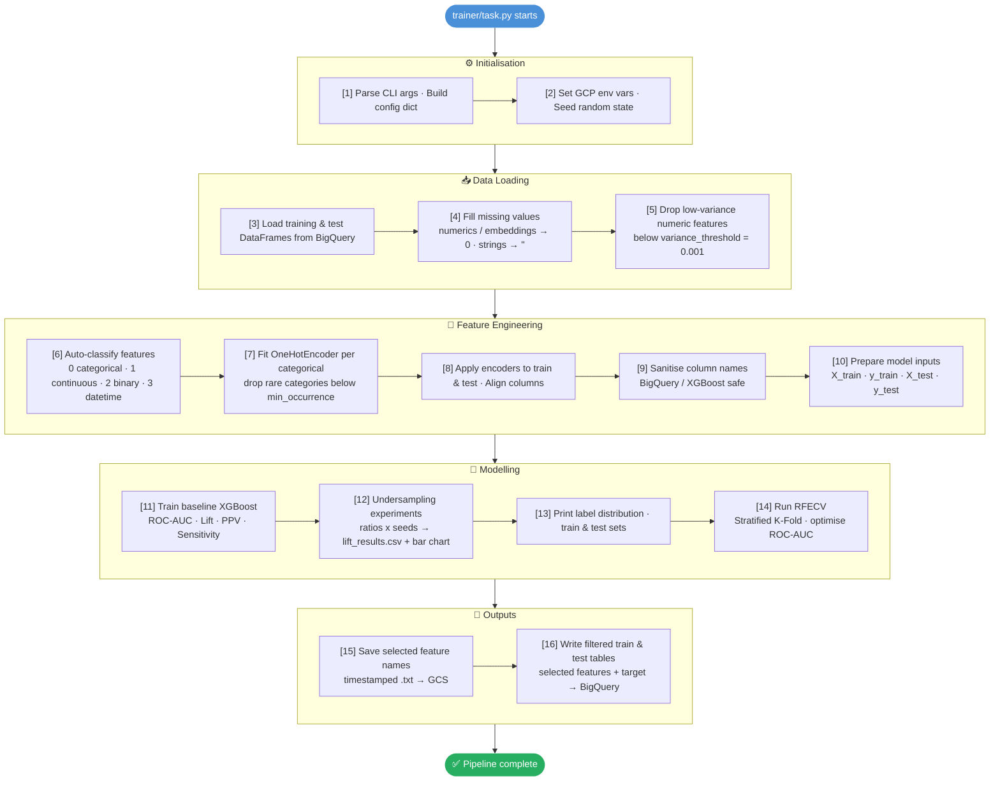

# Feature Engineering

A Vertex AI pipeline that selects the most predictive features from raw clinical and claims data before model training. It loads data from BigQuery, removes low-variance noise, automatically classifies and encodes feature types, runs undersampling experiments to find the best class-balance strategy, and uses **Recursive Feature Elimination with Cross-Validation (RFECV)** to produce a ranked feature list — which is then handed off to the **Vertex Model Trainer** module.

---

## Overview

| Attribute | Value |
|---|---|
| **Purpose** | Feature selection upstream of model training |
| **Model type** | XGBoost classifier (used as the RFECV estimator) |
| **Primary input** | Raw Training data from BigQuery  |
| **Primary output** | Selected feature list (`.txt`) uploaded to GCS + filtered train/test tables in BigQuery |
| **Package version** | `0.1.0` |

---

## Before You Begin

### Install required packages

Install only what the notebook needs to submit the pipeline (not the full trainer):

```bash
pip install google-cloud-aiplatform google-cloud-storage google-cloud-pipeline-components kfp pyyaml cytoolz
```

---

### Getting Started

Follow these steps in order after installing the packages above:

#### Step 1 — Update `config.yaml`

Open `config.yaml` and fill in the values specific to your use case. At minimum, update the following fields:

```yaml
gcp:
  project: "your-vertex-billing-project"   # Compute Project
  gcp_project: "your-bq-project"           # BigQuery project
  gcp_db: "your_bq_dataset"               # BigQuery dataset
  prefix: "your_prefix"                    # Prefix for all output tables
  bucket_name: "your-gcs-bucket"

vertex_ai:
  # https://docs.cloud.google.com/vertex-ai/docs/training/configure-compute#machine-types
  machine_type: "n1-standard-16"  # Machine type (e.g., n1-standard-4, n1-standard-8, n1-standard-16) 
  accelerator_type: None  # GPU accelerator type (e.g., NVIDIA_TESLA_T4, NVIDIA_TESLA_V100, NVIDIA_TESLA_P100, NVIDIA_TESLA_K80) - 
  accelerator_count: 1  # Number of accelerators (only used if accelerator_type is set)
  docker_uri: "us-docker.pkg.dev/vertex-ai/training/xgboost-cpu.2-1:latest" # If using GPU switch to "us-docker.pkg.dev/vertex-ai/training/xgboost-gpu.2-1:latest"
  # For latest prebuilt images check - https://docs.cloud.google.com/vertex-ai/docs/training/pre-built-containers#xgboost
data_processing:
  target_column: "your_target_column"      # Binary outcome column name

sql_queries:
  training_query: |
    SELECT *
    FROM `{GCP_PROJECT}.{GCP_DB}.your_table`
    WHERE ...

  test_query: |
    SELECT *
    FROM `{GCP_PROJECT}.{GCP_DB}.your_table`
    WHERE ...
```

See the full [Configuration Reference](#configuration-reference) below for all available options.

#### Step 2 — Run `feature_engineering.ipynb` through Step 4

Open `feature_engineering.ipynb` and run cells sequentially up to and including **Step 4 (Submit Pipeline to Vertex AI)**. The notebook will:

1. Load and validate `config.yaml`
2. Build the `feature-engineering-trainer` Python package and upload it to GCS
3. Compile the KFP pipeline to `feature_engineering_pipeline.json`
4. Submit the pipeline job to Vertex AI Pipelines and print the job URL

> **Stop here** — do not run further cells until the Vertex AI job has completed successfully.

#### Step 3 — Track the pipeline in Vertex AI

Once the job is submitted, monitor progress in the GCP console:

1. Go to **Vertex AI → Pipelines → Runs** in the [GCP Console](https://console.cloud.google.com/vertex-ai/pipelines)

The job typically takes **30–90 minutes** depending on dataset size and RFECV configuration. When it completes successfully, the selected feature list is uploaded to GCS and the filtered train/test tables are written to BigQuery.

---

### Start small — use 15,000 rows

RFECV is computationally expensive. Before running the full dataset, **always validate the pipeline end-to-end on a small sample first**. Add a `LIMIT` clause to both SQL queries in `config.yaml`:

```yaml
sql_queries:
  training_query: |
    SELECT ...
    FROM `{GCP_PROJECT}.{GCP_DB}.your_table`
    WHERE ...
    LIMIT 15000   # ← add this during development

  test_query: |
    SELECT ...
    FROM `{GCP_PROJECT}.{GCP_DB}.your_table`
    WHERE ...
    LIMIT 3000    # ← proportional test slice
```

Remove the `LIMIT` clauses once you have confirmed the pipeline runs successfully end-to-end.

---

### What you can safely customise

You do not need to touch any Python files to adapt this pipeline to a new use case. Everything is driven by `config.yaml` and the two SQL queries.

| What you want to change | Where to change it |
|---|---|
| Data source / SQL logic | `config.yaml` → `sql_queries` |
| Target / outcome column | `config.yaml` → `data_processing.target_column` |
| Feature type overrides (e.g. force a column to be categorical) | `config.yaml` → `feature_classification.manual_overrides` |
| Undersampling ratios to try | `config.yaml` → `undersampling.ratios` |
| Number of CV folds or RFECV step size | `config.yaml` → `rfecv` |
| Output table names / GCS paths | `config.yaml` → `gcp` + `output` |
| XGBoost hyperparameters | `config.yaml` → `model` |

If you need to add a **new preprocessing step** or **custom encoding logic**, add it in the `trainer/` folder — each file has a focused responsibility (see [Key Files Reference](#key-files-reference) below). The `trainer/` code is packaged and shipped to Vertex AI as-is, so any changes there are automatically picked up on the next pipeline run.

---

## Directory Structure

```
Feature Engineering/
├── config.yaml                        # Master configuration (GCP, SQL, model params, RFECV)
├── pipeline_helpers.py                # Notebook-facing helpers: package build, GCS upload, KFP component
├── setup.py                           # Python package definition for the trainer code
├── feature_engineering.ipynb          # Orchestration notebook — entry point for users
├── feature_engineering_pipeline.json  # Compiled KFP pipeline (auto-generated by notebook)
├── dist/                              # Built .tar.gz package (auto-generated)
├── feature_engineering_trainer.egg-info/  # Package metadata (auto-generated)
├── trainer/                           # Training package submitted to Vertex AI
│   ├── __init__.py
│   ├── task.py                        # Main entry point — orchestrates all pipeline steps
│   ├── config.py                      # CLI argument parsing and config assembly
│   ├── data_loader.py                 # BigQuery data loading, NA filling, variance filtering
│   ├── feature_engineering.py         # Feature classification, OHE fitting and application
│   └── model_training.py             # Baseline model, undersampling experiments, RFECV
└── utils/
    ├── __init__.py
    └── helpers.py                     # Shared utilities (SQL substitution, column sanitisation, date detection)
```

---

## Pipeline Steps

`trainer/task.py` orchestrates the following steps when the Vertex AI Custom Training Job runs:



---

## Quick Start

### 1. Configure `config.yaml`

All pipeline settings are controlled from `config.yaml`. At minimum, review and update:

```yaml
gcp:
  project: "anbc-dev-hcm-cm-de"        # Vertex AI billing project
  gcp_project: "anbc-hcb-dev"          # BigQuery project
  gcp_db: "cm_medicaid_hcb_dev"        # BigQuery dataset
  prefix: "a974930_sahil_test"          # Table prefix for output tables
  bucket_name: "hcm-cm-de-code-hcb-dev"

vertex_ai:
  service_account: "gchcb-hcm-cm-de-ontpd@anbc-dev-hcm-cm-de.iam.gserviceaccount.com"
  cmek_key: "projects/cvs-key-vault-nonprod/..."

data_processing:
  target_column: "pre_term_max"         # Name of the binary outcome column

rfecv:
  step: 10          # Features dropped per RFECV iteration
  cv_folds: 3       # Stratified K-Fold splits
  scoring: "roc_auc"
```

### 2. Run the Orchestration Notebook

Open `feature_engineering.ipynb` and run all cells. The notebook will:

1. Load `config.yaml` into Python dicts
2. Build and upload the `feature-engineering-trainer` Python package to GCS
3. Assemble the full CLI argument list (including base64-encoded SQL, model config, RFECV config)
4. Compile the KFP pipeline to `feature_engineering_pipeline.json`
5. Submit the pipeline to Vertex AI and wait for completion

---

## Configuration Reference

### `config.yaml` Top-Level Sections

| Section | Purpose |
|---|---|
| `gcp` | GCP project IDs, BigQuery dataset, table prefix, SDOH year, GCS bucket |
| `vertex_ai` | Region, service account, CMEK key, Docker image, machine type |
| `bigquery_labels` | Labels and expiration applied to all output BQ tables |
| `sql_queries` | Two SQL queries: `training_query` and `test_query` |
| `data_processing` | Random seeds, embedding pattern, variance threshold, target column, exclusion lists |
| `feature_classification` | Thresholds for binary/categorical detection, sample size, manual overrides |
| `one_hot_encoding` | `min_occurrence` — minimum row count for a category to be kept |
| `model` | Three model configs: `initial_model` (baseline), `undersampling_model`, `rfecv_model` |
| `undersampling` | Ratios, seeds, and evaluation percentile for undersampling experiments |
| `rfecv` | Step size, CV folds, scoring metric, minimum features, parallelism |
| `metrics` | Percentile thresholds for lift/PPV/sensitivity evaluation |
| `output` | Feature file prefix, results CSV filename, bar chart title |
| `bigquery_query` | BQ Storage API, query cache, progress bar, dialect settings |

### SQL Query Structure

Both queries use `{VARIABLE}` placeholders that are substituted at runtime from the `gcp` config section:

| Placeholder | Resolved from |
|---|---|
| `{GCP_PROJECT}` | `gcp.gcp_project` |
| `{GCP_DB}` | `gcp.gcp_db` |
| `{PREFIX}` | `gcp.prefix` |
| `{SDOH_YEAR}` | `gcp.sdoh_year` |

Both queries must return a **target column** (set via `data_processing.target_column`) plus all candidate feature columns. Outcome-only columns should be excluded in the SQL.

### Feature Classification Types

`auto_classify_features()` assigns each column one of four types:

| Type | Code | Criteria |
|---|---|---|
| Categorical | `0` | `object`/`category` dtype, or numeric with ≤ `unique_threshold_categorical` unique values |
| Continuous | `1` | Numeric with many unique values, or matches `emb` / `_amt` naming pattern |
| Binary | `2` | Exactly 2 unique values from known sets (`{0,1}`, `{Y,N}`, `{True,False}`, etc.) |
| Datetime | `3` | Detected by dtype, column name keywords, or value pattern matching |

Use `manual_overrides` in `config.yaml` to force a specific type for any column:

```yaml
feature_classification:
  manual_overrides:
    gender: 0   # Force categorical
    PUD: 2      # Force binary
```

---

## Undersampling Experiments

Before RFECV, the pipeline tests multiple class-balance strategies to identify the best ratio for the final model:

- **Ratio experiments**: trains a model at each `undersampling.ratios` value (e.g. `0.2`, `0.3`, `0.4`, `0.5`) across each seed in `undersampling.seeds`
- **No undersampling baseline**: trains without any resampling
- **Class weights baseline**: trains with inverse-frequency sample weights

Results are saved to `lift_results.csv` and displayed as a bar chart (`1% Lift Across Different Ratios and Seeds`). The best ratio from this experiment should be used when configuring the **Vertex Model Trainer** module.

---

## RFECV — Recursive Feature Elimination

After undersampling experiments, RFECV finds the minimum set of features that maximises ROC-AUC:

```yaml
rfecv:
  step: 10                    # Drop 10 features per iteration
  cv_folds: 3                 # 3-fold stratified cross-validation
  scoring: "roc_auc"          # Optimisation metric
  min_features_to_select: 1   # Never eliminate all features
  n_jobs: -1                  # Use all available cores
```

The RFECV estimator uses the `rfecv_model` XGBoost config. To use GPU acceleration for RFECV, set `device: "cuda"` in that config block.

**Output:**
- A plot of mean test ROC-AUC vs. number of features selected
- A timestamped `.txt` file (one feature name per line) uploaded to GCS:
  `gs://<bucket>/<gcs_destination_path>/<features_file_prefix><timestamp>.txt`
- This file path is the direct input to `--selected-features-path` in the **Vertex Model Trainer**

---

## Output Tables

Two BigQuery tables are written at the end of the pipeline, both containing only the RFECV-selected features plus the target column:

| Table | Content |
|---|---|
| `<gcp_project>.<gcp_db>.<prefix>_selected_features_train_<timestamp>` | Training split with selected features |
| `<gcp_project>.<gcp_db>.<prefix>_selected_features_test_<timestamp>` | Test split with selected features |

Both tables are tagged with the labels from `bigquery_labels` and expire after `expiration_days` days.

---

## Key Files Reference

### `pipeline_helpers.py`

Helper functions used by the orchestration notebook. Not normally modified by users.

| Function | Purpose |
|---|---|
| `build_package()` | Runs `python setup.py sdist` to create the `.tar.gz` package |
| `upload_to_gcs()` | Uploads a local file to a `gs://` URI |
| `build_and_upload_package()` | Combines build + upload in one call |
| `create_custom_training_job_component()` | Creates a KFP `CustomTrainingJobOp` component |
| `generate_compute_environment()` | Builds the list of env vars injected into the training container |

JSON-valued CLI args (`--sql-queries`, `--model-config`, `--rfecv-config`, etc.) are automatically base64-encoded to prevent payload escaping issues in the Vertex AI job submission.

### `trainer/feature_engineering.py`

| Function | Purpose |
|---|---|
| `auto_classify_features()` | Inspects each column and assigns type `0/1/2/3`; supports manual overrides |
| `fit_one_hot_encoders()` | Fits a `OneHotEncoder` per categorical column; drops rare categories |
| `apply_one_hot_encoding()` | Applies fitted encoders to a DataFrame; zero-fills rows not matching kept categories |

### `trainer/model_training.py`

| Function | Purpose |
|---|---|
| `train_baseline_model()` | Trains an XGBoost classifier with `initial_model` config |
| `calculate_metrics()` | Computes ROC-AUC + Lift / PPV / Sensitivity at configurable percentiles |
| `run_undersampling_experiments()` | Loops over ratios × seeds; also tests no-resampling and class-weight strategies |
| `save_undersampling_results()` | Saves results to CSV and renders a seaborn bar chart |
| `run_rfecv()` | Fits RFECV with stratified K-Fold CV; prints optimal feature count |
| `plot_rfecv_results()` | Plots mean CV ROC-AUC vs. number of features |

### `utils/helpers.py`

| Function | Purpose |
|---|---|
| `is_date_column()` | Detects date columns by dtype, name keywords, and value patterns |
| `process_sql_file()` | Substitutes `{VARIABLE}` placeholders in SQL strings from a constants dict |
| `sanitize_column_names()` | Makes column names safe for XGBoost and BigQuery |
| `check_label_distribution()` | Prints class counts and minority/majority ratio |

---

## Dependencies

Key runtime dependencies (see `setup.py` for pinned versions):

```
xgboost==2.1.4
scikit-learn==1.5.2
numpy==1.26.4
scipy==1.15.3
joblib==1.4.2
imbalanced-learn
optuna
shap==0.44.1
pandas
pandas_gbq
google-cloud-bigquery
google-cloud-bigquery-storage
google-cloud-aiplatform
matplotlib
seaborn
tqdm
```

> **Note:** `xgboost==2.1.4` matches the version bundled in the `xgboost-cpu.2-1` prebuilt training image. Do not upgrade without also updating `docker_uri` in `config.yaml`.

---

## GCP Resources Used

| Resource | Identifier |
|---|---|
| Vertex AI project | `anbc-dev-hcm-cm-de` |
| BigQuery project | `anbc-hcb-dev` |
| BigQuery dataset | `cm_medicaid_hcb_dev` |
| GCS bucket | `hcm-cm-de-code-hcb-dev` |
| GCS artifact path | `vertex-test/codecode/` |
| Vertex AI region | `us-east4` |
| Training machine | `n1-standard-16` |
| CMEK key (nonprod) | `projects/cvs-key-vault-nonprod/locations/us-east4/keyRings/gkr-nonprod-us-east4/cryptoKeys/gk-anbc-dev-hcm-cm-de-us-east4` |
| Service account | `gchcb-hcm-cm-de-ontpd@anbc-dev-hcm-cm-de.iam.gserviceaccount.com` |

---